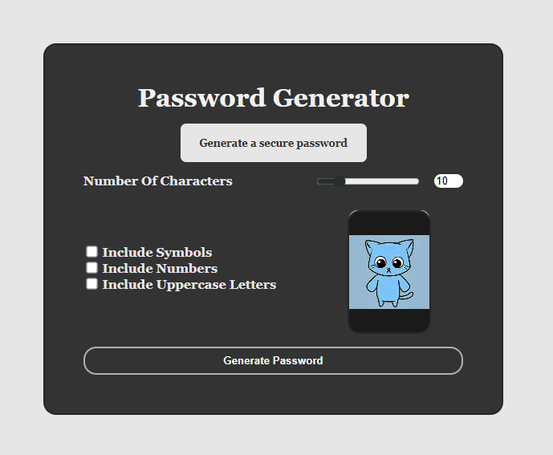

# 🔐 Password Generator

A **modern password generator web app** built with **HTML, CSS, and JavaScript** that lets users easily generate secure, customizable passwords.  
The app includes real-time length control, optional inclusion of uppercase, numbers, and symbols — with a fun animated cat 🐱 following your cursor for extra flair!

🌐 **Live Demo :** [Password Generator](https://password-generator-69.netlify.app/)

---

## 📸 Preview



---

## ✨ Features

- 🔒 **Customizable Passwords** — Adjust character length, include/exclude symbols, numbers, and uppercase.
- 🔄 **Real-Time Sync** — Range slider and numeric input stay in sync.
- ⚙️ **Instant Generation** — Generates a new password instantly on form submit.
- 🐱 **Interactive Animation** — A dancing cat GIF follows the mouse cursor for a fun touch.
- 📱 **Responsive Layout** — Works smoothly across all screen sizes.

---

## 🛠️ Tech Stack

- **HTML5** – Page structure and form elements
- **CSS3** – Styling, layout, responsiveness, and hover animations
- **JavaScript (Vanilla)** – Logic for password generation, user input handling, and interactive animation

---

## 📂 Project Structure

```bash
.
├── index.html              # Main HTML structure
├── /CSS
│   └── style.css           # Styling and responsive design
├── /JavaScript
│   ├── script.js           # Password generation logic
│   └── app.js              # Hover GIF interactivity
├── /Image
│   └── dance-cat.mp4       # Fun animated video used as cursor-following gif
└── README.md               # Documentation

```

## 🧠 How It Works

Use the slider or number input to set password length (1–50 characters).

Toggle checkboxes to include uppercase letters, numbers, or symbols.

Click "Generate Password" to instantly create a secure random password.

Enjoy the animated cat that follows your cursor while generating passwords!

## 🔮 Possible Enhancements

✅ Add “Copy to Clipboard” button for quick copying.

✅ Add password strength indicator (Weak / Medium / Strong).

✅ Save preferences locally using LocalStorage.

✅ Allow user to choose character sets manually.

✅ Add dark/light theme toggle.
